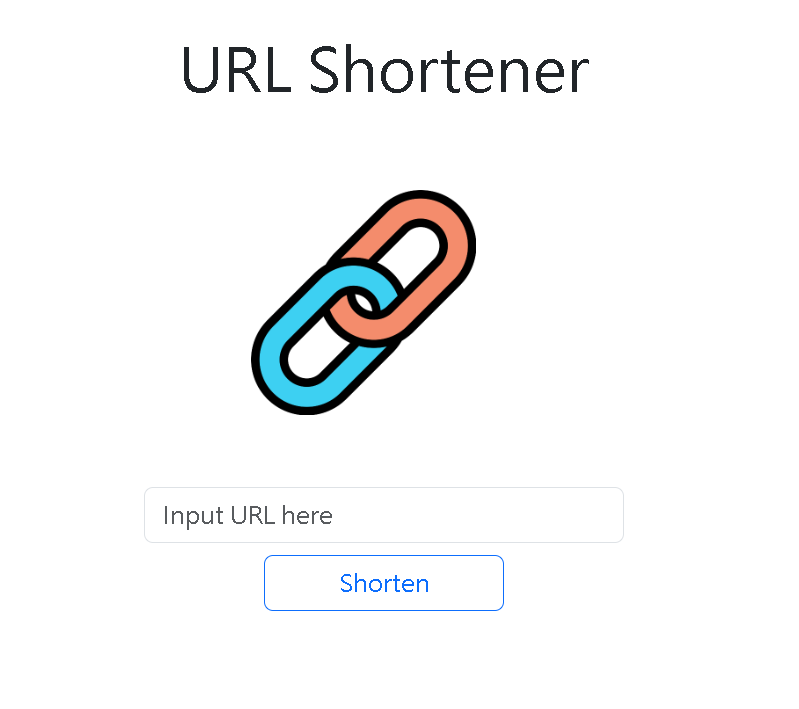

# URL shortener
shorten the original URL by remaining original



## Features
- ✅ shorten the URL (the same original URL will be converted to the same shortened URL)
- ✅ validate the URL you input
- ✅ the shortened link will direct you to your original URL
- ✅ copy the URL you shorten
- ✅ handle not found the original URL 

## Usage
1. Clone the project
2. Install the requireed dependencies by `npm install` in your terminal
3. Set MongoDB Atlas in `.env` file
```
MONGODB_URI=mongodb+srv://<Your MongoDB Account>:<Your MongoDB Password>@cluster0.xxxx.xxxx.net/<Your MongoDB Table><?retryWrites=true&w=majority
```
4. Start the server by `npm run start` in your terminal
5. Execute successfully if you saw following info, then go ahead to `http://localhost:3000` by opening the browser
```
Listening on http://localhost:3000
```
## Package Environment
- node.js 18.13.0
- express 4.18.2
- express-handlebars 7.0.7
- mongoose 7.0.4
- nanoid 3.3.6
- dotenv 16.0.3

## Tools
- Bootstrap 5.3.0

